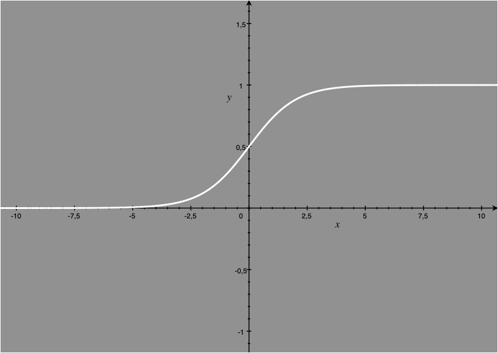
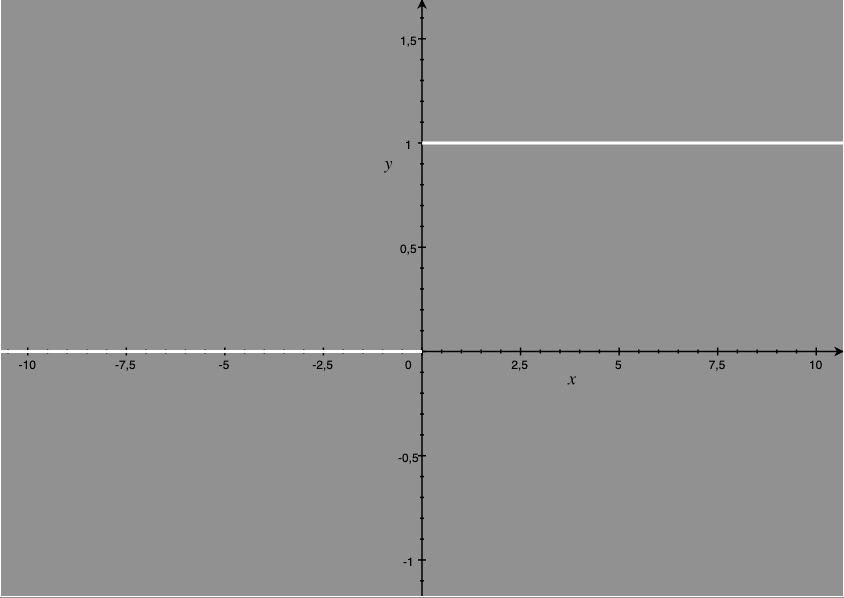

# Deep Learning

A python implementation for inference and training of multilayer perceptron models, completely from scratch.

## Usage

download deep_learning.py and put it in your projects directory, then import it just like a regular module:  
```python
from deep_learning import Perceptron, Layer, Model
```

## Specifiying the model's structure

```python
model = Model(input_size = 3)

input_layer = Layer(layer_type="hidden",num_neurons=4)
model.add_layer(input_layer)

hidden_layer1 = Layer(layer_type="hidden",num_neurons=3)
model.add_layer(hidden_layer1)

output_layer = Layer(layer_type="output",num_neurons=3)
model.add_layer(output_layer)
```

Model's constructor takes the following arguments:

| Argument | Description | Default |
|----------|----------|----------|
| model_type:str | currently only 'simple' is supported | 'simple' |
| input_size:int | size of the input in bits | 2 |
| loss_func:str | loss function that is used see [Loss Functions](#loss-functions) | 'mse' |
| random_seed:int | random seed to ensure reproducability | None |
| neuron_stats:dict | default arguments for each Perceptron's constructor | {} |


Layer's constructor takes the following arguments:

| Argument | Description | Default |
|----------|----------|----------|
| layer_type:str | 'hidden' or 'output' | 'hidden' |
| num_Perceptrons:int | number of neurons in the layer | 2 |
| stats:int | default arguments for each Perceptron's constructor | None |

Perceptron's constructor takes the following arguments:

| Argument | Description | Default |
|----------|----------|----------|
| num_weights:int | number of interbal weights a perceptron possesses | 3 |
| aktivation_fun:str | activation function that is used see [Activation Functions](#activation-functions) | 'sigmoid' |
| l_rate:int | learning rate of the perceptron | 0.01 |
| loss_func:str | loss function that is used see [Loss Functions](#loss-functions) | 'mse' |
| dropout:int | dropout rate of the perceptron | 0 |
| temperature:int | temperature for the sigmoid function if used | 0.1 |

to view the models configuration use ```print(<your-model-object>)```. This will log the resulting model structure.


## Training the model

To train the model on a training sample run ```<your-model-object>.train(input:list, desired:list)``` providing a list of inputs and a list of the desired outputs.
The function returns the current loss. To get an idea of how training could be implemented this way have a look at the [MLP examples](#examples).

## Running the model

To run your model just use ```<your-model-object>.feed_forward(input:list)``` providing your list of input values and you will get a list of the models outputs as the result.
To get an idea of how this could be used for validation have a look at the [MLP examples](#examples).

## Examples

| MLP           | SLP         |
|---------------|-------------|
| count_demo.py | and_demo.py |

MLP = Multi-Layer Perceptron  
SLP = Single-Layer Perceptron

## Loss Functions

This library supports several loss functions:

### 'mse' or 'squared'
The mean squared error function is the  most commonly used error function as it can be derived. it is currently the only function that has MLP support.

### 'linear'
The linear error function is much simpler than the mse, but can only be used for SLP

## Activation Functions

### 'sigmoid'
The sigmoid activation function. Most commonly used in MLPs. You can use the temperature argument of the perceptron to change its appearance. The lower the temperature the more similar it is to a heaviside function. The higher the temperature the smoother it is.



### 'relu'

The rectified linear unit activation function  


### 'leaky_relu'

The leaky rectified linear unit activation function  


### 'heaviside'

The heaviside function can only be used for SLPs  

