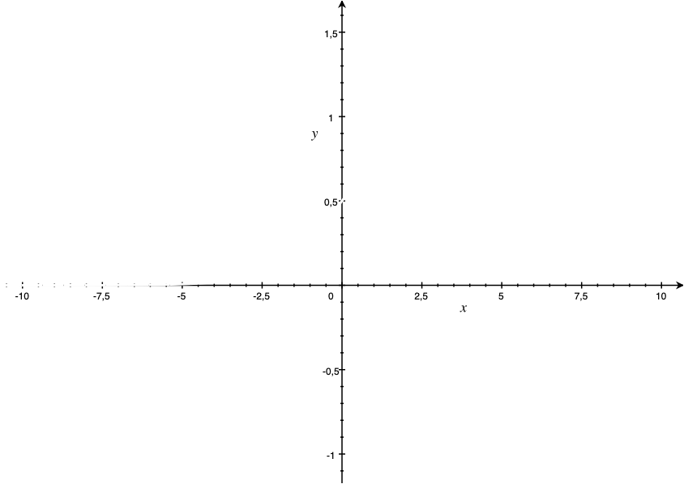
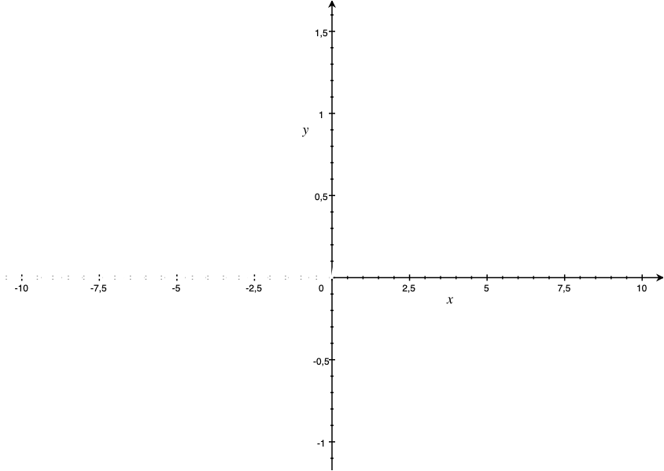
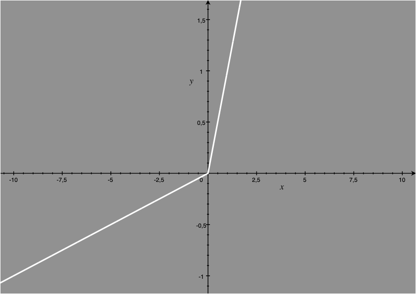
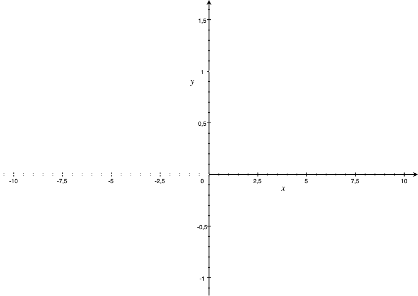

# Deep Learning

A from-scratch python implementation for inference and training of multilayer perceptron models.


## Examples

| MLP           | SLP         |
|---------------|-------------|
| count_demo.py | and_demo.py |


## Specifiying the model's structure

```
model = Model(input_size = 3)

input_layer = Layer(layer_type="hidden",num_neurons=4)
model.add_layer(input_layer)

hidden_layer1 = Layer(layer_type="hidden",num_neurons=3)
model.add_layer(hidden_layer1)

output_layer = Layer(layer_type="output",num_neurons=3)
model.add_layer(output_layer)
```

Model's constrcutor takes the following arguments:

| Argument | Deacription | Default |
|----------|----------|----------|
| model_type:str | currently only 'simple' is supported | 'simple' |
| input_size:int | size of the inout in bits | 2 |
| loss_func:str | loss function that is used see [Loss Functions](#loss-functions) | 'mse' |
| random_seed:int | random seed to ensure reproducability | None |
| neuron_stats:dict | default arguments for each Perceptron's constructor | {} |


Layer's constrcutor takes the following arguments:

| Argument | Deacription | Default |
|----------|----------|----------|
| layer_type:str | 'hidden' or 'output' | 'hidden' |
| num_Perceptrona:int | number of neurons in the layer | 2 |
| stats:int | default arguments for each Perceptron's constructor | None |

Perceptron's constructor takes the following arguments:

| Argument | Deacription | Default |
|----------|----------|----------|
| num_weights:int | number of interbal weights a perceptron possesses | 3 |
| aktivation_fun:str | activation function that is used see [Activation Functions](#activation-functions) | 'sigmoid' |
| l_rate:int | learning rate of the perceptron | 0.01 |
| loss_func:str | loss function that is used see [Loss Functions](#loss-functions) | 'mse' |
| dropout:int | dropout rate of the perceptron | 0 |
| temperature:int | temperature for the sigmoid function if used | 0.1 |

## Loss Functions

This library supports several loss functions:

### 'mse' or 'squared'
The mean squared error function is the  most commonly used error function as it can be derived. it is currently the only function that has MLP support.

### 'linear'
The linear error function is much simpler than the mse, but can only be used for SLP

## Activation Functions

### 'sigmoid'
The sigmoid activation function. Most commonly used in MLPs



### 'relu'



### 'leaky_relu'



### 'heaviside'

The heaviside function can only be used for SLPs

